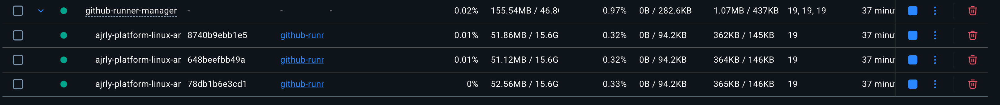
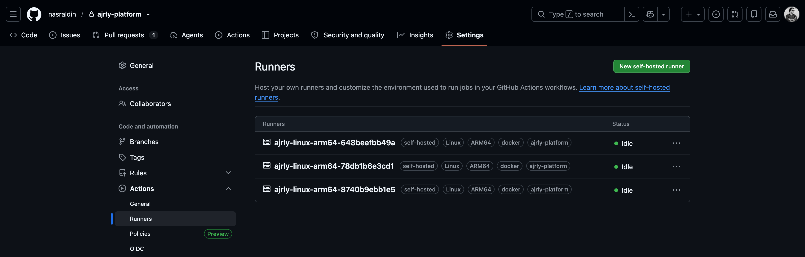

# GitHub Self-Hosted Runner Manager

Professional multi-project, multi-runner-platform manager for private GitHub Actions self-hosted runners.

The manager itself is project-agnostic. Repository names, labels, runner counts, OS, architecture, and package hashes are read from your local `runners.config.json`.

The Linux runner image base is configurable. The default is:

```text
node:lts-bullseye
```

## What It Supports

- Multiple GitHub repositories from one config file.
- Multiple runner pools per repository.
- Linux Docker runners through generated Docker Compose.
- macOS native runners through generated host commands.
- Windows native runners through generated PowerShell commands.
- Windows Docker runner pools modeled in config for Windows Docker hosts.
- x64 and ARM64 package metadata.
- Ephemeral runners, automatic re-registration, and clean shutdown when a `GITHUB_TOKEN` is available.

## Configuration

Create a local config from the public example:

```bash
make config-init
```

Then edit `runners.config.json` for your own repositories. This file is ignored by Git so private repository metadata stays local. The committed `runners.config.example.json` shows the expected structure:

```json
{
  "projects": [
    {
      "id": "project-id",
      "owner": "github-owner",
      "repo": "github-repo",
      "pools": [
        {
          "id": "linux-x64-docker",
          "enabled": true,
          "runtime": "docker",
          "runnerPackage": "linux-x64-2.335.1",
          "baseImage": "node:lts-bullseye",
          "replicas": 3,
          "labels": ["self-hosted", "linux", "x64", "docker", "project-id"]
        }
      ]
    }
  ]
}
```

Secrets stay in `.env`:

```bash
make env
```

Set `GITHUB_TOKEN` in `.env` to a GitHub token with permission to manage repository self-hosted runners.

For a classic PAT, GitHub documents the required `repo` scope for repository-level runner registration. For a fine-grained token, grant repository access and `Administration` write permission for each configured repository.

## Makefile Operations

The `Makefile` is the main operations interface for local testing and production hosts.

```bash
make help
make env
make config-init
make validate
make doctor
make list-pools
make apply
make logs-generated
```

`make apply` generates `compose.generated.yaml`, builds enabled Docker pool images, and starts each pool with the replica count from your local config.

Common commands:

```bash
make ps-generated
make restart-generated
make stop
```

You can override operational variables when needed:

```bash
make logs-generated LOG_TAIL=500
make apply ENV_FILE=.env.production
make validate-example CONFIG_FILE=runners.config.example.json
```

## Recommended Flow

List enabled, disabled, and skipped pools:

```bash
make list-pools
```

Validate the generated Docker Compose stack:

```bash
make validate
```

Generate, build, and start all enabled Docker pools:

```bash
make apply
```

## Expected Running State

After `make apply`, each enabled Linux Docker pool should create the configured number of runner containers. For example, a pool with `replicas: 3` should show three healthy containers:



The same runners should also appear online in the repository's GitHub Actions runner settings:



Stop generated pools:

```bash
make stop
```

## Scaling Running Pools

Runner counts are configured in `runners.config.json`, not `.env`.

To increase an already-running Linux pool from 3 to 5 runners:

1. Edit the target pool in `runners.config.json`.
2. Change `replicas`:

```json
"replicas": 5
```

3. Re-apply the config:

```bash
make apply
```

4. Confirm the containers:

```bash
make ps-generated
```

5. Confirm the runners in GitHub:

```bash
gh api repos/<owner>/<repo>/actions/runners \
  --jq '.runners[] | [.name, .status, .busy] | @tsv'
```

`make apply` is idempotent: it regenerates Compose, builds if needed, and scales each enabled Docker pool to the replica count in JSON.

## Single-Pool Compatibility Mode

`compose.yaml` is kept as an advanced compatibility template for quick tests. Production and normal usage should use `runners.config.json` plus `make apply` so project, label, platform, and replica settings have one source of truth.

If you use the compatibility template, pass the replica count as a Make variable:

```bash
make up SINGLE_POOL_REPLICAS=1
```

## Native macOS And Windows

Print native install commands from the same JSON config:

```bash
make native-instructions PROJECT=project-id POOL=macos-arm64-native
make native-instructions PROJECT=project-id POOL=windows-x64-native
make native-instructions PROJECT=project-id POOL=windows-arm64-native
```

Before running those commands on the target host, export or set a fresh one-hour registration token in `GITHUB_RUNNER_REGISTRATION_TOKEN`.

For production automation, prefer `GITHUB_TOKEN`-based wrappers so hosts can fetch fresh registration and removal tokens automatically.

## Workflow Targeting

Use explicit labels from your pool config:

```yaml
runs-on: [self-hosted, linux, x64, docker, project-id]
```

Each runner container handles one concurrent job. The default active pool uses `replicas: 3`, so it creates three runner containers for three concurrent jobs.

## Production Install With Systemd

Copy this project to `/opt/github-runner-manager`, create `/opt/github-runner-manager/.env` and `/opt/github-runner-manager/runners.config.json`, then:

```bash
make systemd-install
make systemd-enable
make systemd-start
make systemd-status
```

## Security

Docker runner pools mount `/var/run/docker.sock`, which is effectively root access to the host. Use these runners only for trusted private repository workflows.

See:

- [Configuration Guide](docs/configuration.md)
- [Operations Runbook](docs/operations.md)
- [Production Validation Report](docs/production-validation.md)
- [Security Runbook](docs/security.md)
