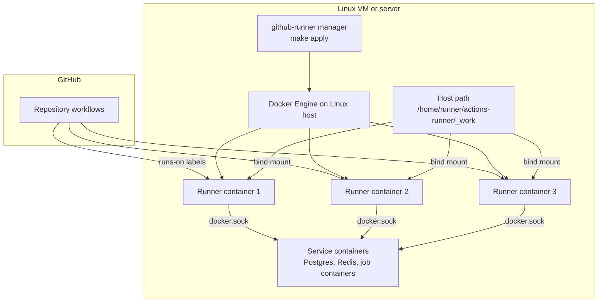

# Production Setup Guide

This guide explains how to run the GitHub Self-Hosted Runner Manager on a **Linux VM or server** for real production CI — including workflows that use GitHub Actions **job containers** (`container:`) and **service containers** (`services:`), such as Postgres, Redis, or Semgrep.

Use your Mac with Docker Desktop for local development and smoke tests. Use a Linux host for production-equivalent CI.

## Production Architecture




### How it fits together

1. **GitHub** schedules a workflow job and picks a runner by `runs-on` labels.
2. The **runner manager** (`make apply`) keeps N runner containers registered for each enabled pool.
3. Each **runner container** runs the GitHub Actions listener and mounts:
   - `/var/run/docker.sock` — so jobs can run `docker build`, service containers, and job containers
   - `/home/runner/actions-runner/_work` — the job workspace, bind-mounted from the **Linux host**
4. When a workflow uses `container:` or `services:`, Docker on the Linux host starts child containers and bind-mounts `_work`. That only works when `_work` exists on the host at the same path.

One runner container handles **one concurrent job**. Set `replicas` in `runners.config.json` for the concurrency you need.

## Dev Host vs Production Host

|                                               | Mac + Docker Desktop (dev)                    | Linux VM + Docker Engine (production) |
| --------------------------------------------- | --------------------------------------------- | ------------------------------------- |
| Runner manager                                | Same project, `make apply`                    | Same project, `make apply`            |
| Docker                                        | Docker Desktop on macOS                       | Docker Engine on Linux                |
| Plain CI jobs (no `container:` / `services:`) | Works                                         | Works                                 |
| `container:` and `services:` jobs             | Use `runnerWorkHostPath` under `/Users/...`   | Works with `_work` host bind mount    |
| Linux x64 pools                               | Poor fit (QEMU issues on ARM Mac)             | Native on x64 VM                      |
| macOS / Windows native pools                  | Use `make native-instructions` on those hosts | Not applicable on Linux               |

### The `_work` mount error on Mac

If you see:

```text
Error response from daemon: mounts denied:
The path /home/runner/actions-runner/_work is not shared from the host and is not known to Docker.
```

That is expected on **Mac + Docker Desktop** when workflows use `container:` or `services:`. The path exists inside the runner container but not on the Docker Desktop host.

**Fix on Mac:** see [Self-Hosted Runner Issues and Solutions](self-hosted-runner-issues-and-solutions.md) for the full Mac Docker Desktop troubleshooting guide.

### Why macOS needs a Docker path rewrite

Job containers mount paths like `/home/runner/actions-runner/_work/_temp/_github_home`. Inside the runner container those paths exist, but Docker Desktop resolves bind mounts on the **Mac host**, where `/home/runner/...` does not exist. When `runnerWorkHostPath` differs from the container path, the manager:

1. Bind-mounts `workspaces/` (per-replica isolation) and `externals/` — not the full `actions-runner` dir (that would hide `config.sh` from the image)
2. Registers each runner with `--work workspaces/<hostname>/_work` (no `_work` symlink; required for `checkout@v6+` git auth)
3. Installs a `docker` wrapper that rewrites `-v /home/runner/...` and `-v /opt/hostedtoolcache` to host paths under `/Users/...`

See [Self-Hosted Runner Issues and Solutions](self-hosted-runner-issues-and-solutions.md) for checkout auth, `/github/home`, and related Mac workarounds.

## Host Requirements

Recommended baseline per heavy monorepo pool:

| Resource | Minimum                                             |
| -------- | --------------------------------------------------- |
| CPU      | 4 vCPU                                              |
| RAM      | 8 GB                                                |
| Disk     | 40 GB free (images, caches, workspaces)             |
| OS       | Ubuntu 22.04/24.04 LTS or similar Linux             |
| Network  | Outbound HTTPS to `github.com` and `api.github.com` |

Supported VM providers include Parallels Ubuntu, Hetzner, AWS EC2, GCP Compute, or any bare-metal Linux server.

## Step-by-Step Production Install

### 1. Provision the Linux VM

Create an Ubuntu (or Debian) VM. SSH in as a user with `sudo`.

Install Docker Engine and the Compose plugin using your distribution’s recommended method. Confirm:

```bash
docker version
docker compose version
```

Note the Docker socket group ID (used later if needed):

```bash
stat -c '%g %n' /var/run/docker.sock
```

### 2. Install the runner manager

Clone this repository on the Linux host:

```bash
sudo mkdir -p /opt/github-runner-manager
sudo chown "$USER":"$USER" /opt/github-runner-manager
git clone https://github.com/nasraldin/github-runner.git /opt/github-runner-manager
cd /opt/github-runner-manager
```

Create local config and secrets:

```bash
make env
make config-init
```

Edit `runners.config.json`:

- Set `owner`, `repo`, and `id` for each project
- Enable the correct pool (`linux-x64-docker` or `linux-arm64-docker`)
- Set `replicas` (default `3` = three concurrent jobs)
- Set `labels` to match workflow `runs-on` in your repositories

Edit `.env`:

```bash
GITHUB_TOKEN=ghp_...   # PAT with repo admin access, or fine-grained with Administration write
# Optional if socket group is not 999:
# DOCKER_GID=999
```

Never commit `.env` or `runners.config.json`.

### 3. Create the workspace directory on the host

GitHub Actions expects the runner work directory at:

```text
/home/runner/actions-runner/_work
```

From the manager directory on the **Linux host**, run:

```bash
make init-workdir
```

This runs `scripts/init-runner-workdir.sh` with `sudo` and:

- creates `/home/runner/actions-runner/_work`
- sets ownership to UID/GID `1000` (the `runner` user inside the container)

To use a different UID/GID:

```bash
sudo RUNNER_UID=1001 RUNNER_GID=1001 scripts/init-runner-workdir.sh
```

Manual equivalent:

```bash
sudo mkdir -p /home/runner/actions-runner/_work
sudo chown -R 1000:1000 /home/runner/actions-runner/_work
```

> **macOS note:** Symlinks under `/home` (for example `/home/runner` → `/Users/runner`) fail on macOS with `Operation not supported`. `make init-workdir` instead:
>
> 1. Tries to create `/home/runner/actions-runner/_work` as real directories, or
> 2. Falls back to `/Users/<you>/github-runner/actions-runner/_work`
>
> The script prints the `runnerWorkHostPath` to add to `runners.config.json`. On Mac, host and container paths differ:

```json
"runnerWorkHostPath": "/Users/you/github-runner/actions-runner/_work",
"runnerWorkContainerPath": "/home/runner/actions-runner/_work"
```

Then run `make apply`. For production, prefer a Linux VM where both paths can be the same.

### 4. Configure the `_work` bind mount

Set in `runners.config.json` (under `defaults` or per pool):

```json
"runnerWorkHostPath": "/home/runner/actions-runner/_work",
"runnerWorkContainerPath": "/home/runner/actions-runner/_work"
```

On macOS after `make init-workdir`, use the host path the script printed for `runnerWorkHostPath`. Keep `runnerWorkContainerPath` as `/home/runner/actions-runner/_work`.

Verify generation and apply:

```bash
make validate
make generate
```

Confirm each runner service in `compose.generated.yaml` includes:

```yaml
- /home/runner/actions-runner/_work:/home/runner/actions-runner/_work
```

On macOS the host side is typically under `/Users/...` (see `make init-workdir` output).

### 5. Validate and start

```bash
make doctor
make list-pools
make apply
make ps-generated
```

Confirm runners appear in GitHub:

**Settings → Actions → Runners** for each configured repository.

Or with the GitHub CLI:

```bash
gh api repos/<owner>/<repo>/actions/runners \
  --jq '.runners[] | [.name, .status, .busy] | @tsv'
```

### 6. Enable systemd (recommended)

For always-on runners that survive reboots:

```bash
make systemd-install
make systemd-enable
make systemd-start
make systemd-status
```

The unit runs from `/opt/github-runner-manager` and executes `make apply` on start.

## Workflow Targeting

Use labels from your pool config in repository workflows:

```yaml
runs-on: [self-hosted, linux, x64, docker, my-project-id]
```

Example for an ARM64 Linux pool:

```yaml
runs-on: [self-hosted, linux, arm64, docker, my-project-id]
```

Workflows that use service containers (Postgres, Redis) and job containers (`container: node:24-bookworm`) require the production `_work` bind mount described above.

## Scaling

Edit `replicas` in `runners.config.json` for the target pool:

```json
"replicas": 5
```

Apply:

```bash
make apply
make ps-generated
```

Each replica is one runner container and one concurrent job slot.

## Operations Quick Reference

| Task                          | Command                  |
| ----------------------------- | ------------------------ |
| Create host `_work` directory | `make init-workdir`      |
| Start / update runners        | `make apply`             |
| View containers               | `make ps-generated`      |
| Follow logs                   | `make logs-generated`    |
| Stop runners                  | `make stop`              |
| Restart after token rotation  | `make restart-generated` |
| Validate config               | `make validate`          |
| Check GitHub API + Docker     | `make doctor`            |

See [Operations Runbook](operations.md) for the full runbook.

## Troubleshooting

### `mounts denied` for `_work`

- **On Mac:** expected for `container:` / `services:` jobs. Use a Linux VM for those workflows, or refactor workflows to start Postgres/Redis manually without GHA `services:`.
- **On Linux:** run `make init-workdir`, then ensure `/home/runner/actions-runner/_work` is bind-mounted into runner containers (step 4).

### Docker commands fail inside jobs

- Confirm `/var/run/docker.sock` is mounted in `compose.generated.yaml`.
- Confirm the host Docker daemon is running: `docker ps`.
- Set `DOCKER_GID` in `.env` to match `stat -c '%g' /var/run/docker.sock`, then `make restart-generated`.

### Jobs do not pick up runners

- Confirm workflow `runs-on` labels match the pool’s `labels` in `runners.config.json`.
- Confirm runners show **Idle** (not offline) in GitHub settings.
- Confirm the pool is `enabled: true`.

### Runner disappears after each job

Expected when `ephemeral: true` in config. Compose restarts the container and registers a fresh runner automatically.

## Security

Docker runner pools mount `/var/run/docker.sock`, which grants effective root access to the host Docker daemon. Use these runners only for **trusted private repositories** and workflows you control.

See [Security Runbook](security.md).

## Related Docs

- [Configuration Guide](configuration.md) — `runners.config.json` structure and pools
- [Operations Runbook](operations.md) — day-to-day commands and systemd
- [Production Validation Report](production-validation.md) — what was validated on which hosts
