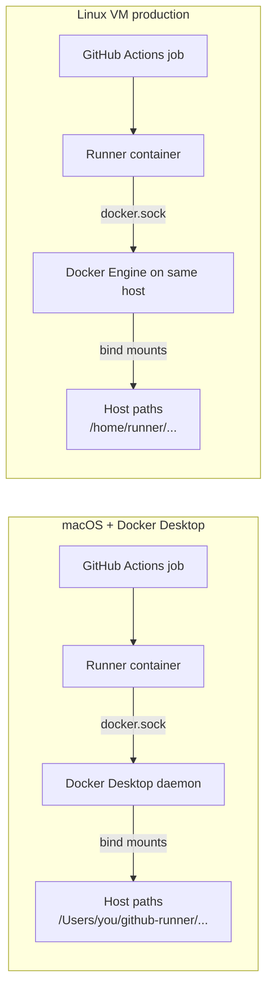
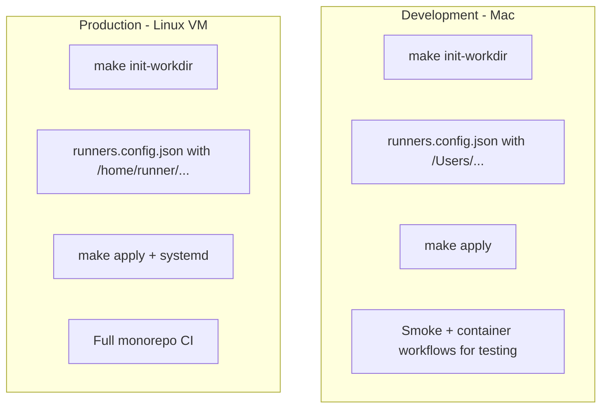

# Self-Hosted Runner Issues and Solutions

This document records the problems encountered while running the GitHub Self-Hosted Runner Manager on **macOS with Docker Desktop** for the `ajrly-platform` monorepo, and the solutions implemented in this repository.

Use it as:

- A troubleshooting reference for Mac-based dev/test hosts
- Background for a production proposal (why Linux VMs are recommended for real CI)
- Onboarding material for anyone configuring `runners.config.json` and workflows

## Context

| Item              | Value                                           |
| ----------------- | ----------------------------------------------- |
| Manager repo      | `github-runner`                                 |
| Target monorepo   | `nasraldin/ajrly-platform`                      |
| Dev host          | macOS ARM64 + Docker Desktop                    |
| Runner pool       | `linux-arm64-docker` (runner containers on Mac) |
| Production target | Linux VM + Docker Engine                        |

Workflows were updated to use self-hosted labels:

```yaml
runs-on: [self-hosted, linux, arm64, docker, ajrly-platform]
```

No monorepo workflow changes are required beyond `runs-on` labels. All fixes below are in the **runner manager** (image, compose generation, host paths, scripts).

---

## Architecture: Why Mac Is Harder Than Linux



**Docker-out-of-Docker (DooD):** Runner containers mount `/var/run/docker.sock`. When a workflow uses `container:` or `services:`, the runner asks the **host** Docker daemon to create child containers and bind-mount paths like `/home/runner/actions-runner/_work`.

|                                            | macOS + Docker Desktop                 | Linux VM                              |
| ------------------------------------------ | -------------------------------------- | ------------------------------------- |
| Runner manager                             | `make apply`                           | `make apply`                          |
| Plain jobs (no `container:` / `services:`) | Works                                  | Works                                 |
| `container:` / `services:` jobs            | Needs host path workarounds (this doc) | Works with `/home/runner/...` on host |
| Recommended role                           | Dev / smoke tests                      | Production CI                         |

---

## Issue 1: Workflow `runs-on` Still Used GitHub-Hosted Runners

### Symptom

Jobs ran on `ubuntu-latest` instead of local runners.

### Cause

Workflows had not been pointed at self-hosted runner labels.

### Solution

Update monorepo workflows to use pool labels from `runners.config.json`:

```yaml
runs-on: [self-hosted, linux, arm64, docker, ajrly-platform]
```

Reusable workflows (`ci-cd.yml`, `sonarqube-scan.yml`) accept an optional `runner_labels` input with the same default.

Add a manual smoke workflow (`.github/workflows/self-hosted-smoke.yml`) for quick validation.

---

## Issue 2: `_work` Mount Denied on Docker Desktop

### Symptom

```text
Error response from daemon: mounts denied:
The path /home/runner/actions-runner/_work is not shared from the host and is not known to Docker.
```

Seen on workflows with `container:` and `services:` (Postgres, Redis, Semgrep).

### Cause

- Job/service containers bind-mount `/home/runner/actions-runner/_work`
- That path exists **inside** the runner container, not on the Mac host
- Docker Desktop only shares paths under `/Users/...` by default

### What does not work on macOS

- Symlink `/home/runner` → `/Users/runner` → `Operation not supported`
- Creating `/home/runner` on Mac for Docker File Sharing → unreliable

### Solution

1. **Host paths under `/Users/...`** via `make init-workdir`:

   ```text
   /Users/<you>/github-runner/actions-runner/_work
   /Users/<you>/github-runner/hostedtoolcache
   ```

2. **`runners.config.json`** (Mac):

   ```json
   "runnerWorkHostPath": "/Users/nasr/github-runner/actions-runner/_work",
   "runnerWorkContainerPath": "/home/runner/actions-runner/_work",
   "runnerToolcacheHostPath": "/Users/nasr/github-runner/hostedtoolcache"
   ```

3. **Bind-mount only `_work`** into the runner container (not the full `actions-runner` tree — see Issue 4).

4. **Docker path-rewrite wrapper** (`runner/docker-wrapper.sh`) rewrites `-v` paths before calling the real Docker CLI.

---

## Issue 3: Runners Stuck in Init / Crash Loop

### Symptom

Containers show `Restarting (1)` or stay in init. Logs:

```text
runuser: failed to execute /home/runner/actions-runner/config.sh: No such file or directory
```

### Cause

Compose bind-mounted the **entire** host `actions-runner` directory over `/home/runner/actions-runner`, hiding the runner install from the image (`config.sh`, `run.sh`, etc.). The host directory only contained `_work`.

### Solution

Mount **only** the workspace subdirectory:

```yaml
volumes:
  - /Users/nasr/github-runner/actions-runner/_work:/home/runner/actions-runner/_work
```

Never bind-mount the full `actions-runner` directory over the image path.

`generate-compose.mjs` uses `workspaceVolumeLines()` for this — not the parent `actions-runner` folder.

---

## Issue 4: Invalid Docker Volume Spec (`too many colons`)

### Symptom

```text
docker: invalid spec: /Users/.../externals:/__e:ro:/__e:ro: too many colons
```

### Cause

The docker wrapper split volume strings on the **first** `:` and duplicated the destination, breaking mounts like `externals:/__e:ro`.

### Solution

Rewrite volumes by **prefix replacement only**:

```text
/home/runner/actions-runner/externals:/__e:ro
  → /Users/nasr/github-runner/actions-runner/externals:/__e:ro
```

No manual splitting of `source:dest:options`.

---

## Issue 5: `/opt/hostedtoolcache` Mount Denied

### Symptom

Job container starts, then fails:

```text
The path /opt/hostedtoolcache is not shared from the host and is not known to Docker.
```

### Cause

GitHub Actions mounts `/opt/hostedtoolcache` into job containers. Inside the runner container it exists via a named volume, but the **host** Docker daemon does not see `/opt/hostedtoolcache` on macOS.

### Solution

1. Auto-derive host toolcache from work path:

   ```text
   .../actions-runner/_work  →  .../hostedtoolcache
   ```

2. Bind-mount host toolcache in compose:

   ```yaml
   - /Users/nasr/github-runner/hostedtoolcache:/opt/hostedtoolcache
   ```

3. Extend docker wrapper to rewrite `/opt/hostedtoolcache` → host path.

4. Create the directory in `make init-workdir` and `make apply` (`ensure-host-dirs`).

---

## Issue 6: `checkout@v7` — `node24` Not Found in Job Container

### Symptom

Job container and service containers start, then:

```text
exec: "/__e/node24/bin/node": stat /__e/node24/bin/node: no such file or directory
```

### Cause

1. The runner downloads action externals (`node24`, etc.) into `/home/runner/actions-runner/externals` **at job time**
2. Job containers bind-mount **host** `externals` (rewritten to `/Users/.../externals`)
3. On macOS Docker Desktop, the runner container path `/home/runner/...` is **not** the same filesystem as the Mac host — copying to `RUNNER_DOCKER_HOST_PATH_PREFIX` from inside the runner container writes to a path inside the Linux container, not on the Mac

### Solution

**Bind-mount `externals` into the runner container** (same pattern as `_work`):

```yaml
- /Users/nasr/github-runner/actions-runner/externals:/home/runner/actions-runner/externals
```

The image seeds `/opt/runner-externals-seed` at build time; entrypoint copies into the bind mount when the host directory is empty. After that, runner downloads (`node24`, etc.) land directly on the host and job containers see them via the docker wrapper path rewrite.

Do **not** rely on copying to `RUNNER_DOCKER_HOST_PATH_PREFIX` from inside the runner container — that path is not reachable on the Mac host.

---

## Issue 7: Empty Compose `volumes:` Validation Error

### Symptom

```text
validating compose.generated.yaml: volumes must be a mapping
```

### Cause

When all pools use host bind mounts (no named toolcache volumes), the generator emitted an empty top-level `volumes:` block.

### Solution

Omit the top-level `volumes:` section when there are no named volumes. `generate-compose.mjs` only declares named volumes when a pool still uses them.

---

## Issue 8: `_work/_actions` Access Denied (Multiple Replicas)

### Symptom

```text
Error: Access to the path '/home/runner/actions-runner/_work/_actions' is denied.
```

During **Prepare workflow directory**, often with `replicas` > 1.

### Cause

Compose `--scale` runs multiple runner containers from one service definition. If they all bind-mount the **same** host `_work` path, they fight over shared directories (`_actions`, `_temp`, `_PipelineMapping`). Concurrent jobs cause permission errors and root-owned stale dirs.

### Solution

On macOS (path rewrite mode), bind-mount `workspaces/` instead of `_work`. Each container registers with `--work workspaces/<hostname>/_work` (no symlink). Symlinks break `actions/checkout@v6+` git credential `includeIf.gitdir` matching.

The docker wrapper maps work paths to `.../workspaces/<hostname>/_work/...` on the host. Keep `RUNNER_DOCKER_HOST_PATH_PREFIX` at the actions-runner host root.

`externals/` remains shared (safe to share across replicas).

---

## Issue 9: `/github/home` — pnpm / node-gyp `ENOTDIR`

### Symptom

Container jobs get past checkout, then `pnpm install` fails:

```text
ENOTDIR: not a directory, mkdir '/github/home'
EEXIST: file already exists, mkdir '/github/home'
Cannot find module '/github/home/setup-pnpm/...'
```

### Cause

The docker wrapper rewrote resolved work paths incorrectly when `RUNNER_DOCKER_HOST_PATH_PREFIX` included `workspaces/<hostname>`, double-prefixing to `.../workspaces/<id>/workspaces/<id>/_work/...`. Docker mounted a bad host path onto `/github/home`, leaving it as a **file** instead of a directory.

### Solution

Keep `RUNNER_DOCKER_HOST_PATH_PREFIX` at the actions-runner host root. Export dedicated work-path variables and rewrite `_work` mounts in `docker-wrapper.sh` before the generic prefix rule.

---

## Issue 10: `checkout@v7` — Git Auth Fails on PR Fetch

### Symptom

```text
fatal: could not read Username for 'https://github.com': terminal prompts disabled
The process '/usr/bin/git' failed with exit code 128
```

During `actions/checkout@v7` when fetching a PR merge ref, for example:

```text
git fetch ... origin +<sha>:refs/remotes/pull/119/merge
```

Job logs may show workspace paths under `.../workspaces/<container-id>/_work/...` (after the runner fix) or legacy `.../_work/...` (if an old symlink layout is still in use).

### Cause

`checkout@v6+` stores credentials using git `includeIf.gitdir` rules that must match the **real** `.git` directory path on disk.

On macOS path-rewrite pools, we isolate each replica under `workspaces/<hostname>/_work`. If `_work` is a **symlink** to that path, checkout configures auth for the symlink path while git resolves the canonical path — credentials are not applied and HTTPS fetch prompts for a username.

This is separate from missing `GITHUB_TOKEN` permissions (see fallbacks below).

### Solution (runner manager)

Register each runner with the real work path — **no `_work` symlink**:

```text
--work workspaces/<hostname>/_work
```

Implemented in `runner/entrypoint.sh` for macOS path-rewrite pools. After changing this, run `make apply` so containers re-register.

Confirm in runner logs or `.runner`:

```json
"workFolder": "workspaces/<container-id>/_work"
```

### If checkout still fails (workflow-side)

After `make apply`, if auth errors persist (common on **fork PRs to private repos** or workflows with restricted default token permissions), update the workflow:

**1. Grant read access to repository contents** (workflow or job level):

```yaml
permissions:
  contents: read
```

**2. Pass the job token explicitly to checkout:**

```yaml
- uses: actions/checkout@v7
  with:
    token: ${{ github.token }}
```

For PRs from forks, `GITHUB_TOKEN` may remain read-only or unavailable for the head repo; you may need a PAT secret with `contents: read` and `pull-requests: read`:

```yaml
- uses: actions/checkout@v7
  with:
    token: ${{ secrets.GH_PAT }}
```

**3. Temporary workaround:** pin `actions/checkout@v4` (older credential layout; not recommended long-term).

### Verify

```bash
# Runner registered with per-instance work path (not symlink)
docker exec <runner-container> cat /home/runner/actions-runner/.runner | grep workFolder

# No legacy symlink
docker exec <runner-container> ls -la /home/runner/actions-runner/_work
# should fail with "No such file or directory" — that is expected
```

---

## Issue 11: Manual Directory Creation

### Symptom

`make apply` fails with missing host paths, or runners cannot create workspace/toolcache directories.

### Solution

| Command                  | Creates                                                                                           |
| ------------------------ | ------------------------------------------------------------------------------------------------- |
| `sudo make init-workdir` | `_work`, `hostedtoolcache`, `pnpm-store`, `externals`, `workspaces` (OS-specific paths)           |
| `make apply`             | Runs `ensure-host-dirs` first — creates any missing paths from `runners.config.json` without sudo |

`init-workdir` only sets ownership on the **top-level** directories it creates. It does not run `chown -R` through `workspaces/` (that would walk every CI checkout and `node_modules` tree and can hang for minutes).

The runner **entrypoint** follows the same rule — never `chown -R` on bind-mounted `workspaces/`, `pnpm-store`, or `hostedtoolcache`. If containers start but stay `unhealthy` with empty logs, they were likely stuck on a recursive chown; run `make apply` after updating the runner image.

`init-workdir` detects OS via `uname`:

- **macOS** → `/Users/<user>/github-runner/...` (or `/home/...` if usable)
- **Linux** → `/home/runner/actions-runner/_work`, `/home/runner/hostedtoolcache`, `/home/runner/pnpm-store`

---

## Issue 12: `pnpm install` — Noisy Logs, `reused 0`, Native `gyp` Output

### Symptom

Long `pnpm install` on self-hosted runners with output like:

```text
reused 0, downloaded 3391, added 3477, done
.../msgpackr-extract install: TypeError [ERR_INVALID_ARG_TYPE] ...
.../bufferutil install: gyp info ...
Done in 4m 51.3s using pnpm v11.9.0
```

Install **succeeds** (step is green) but is slow and looks alarming.

### What is normal (not a runner failure)

| Signal                                                       | Meaning                                                                                                                                         |
| ------------------------------------------------------------ | ----------------------------------------------------------------------------------------------------------------------------------------------- |
| `reused 0` on first run                                      | Cold pnpm store in a fresh workspace/container. Expected on ephemeral runners.                                                                  |
| `msgpackr-extract` TypeError then “attempt to build locally” | Optional BullMQ native addon; prebuilt check fails on Node 24 + linux arm64; pnpm falls back to source compile. Noisy but often still succeeds. |
| `bufferutil` / `utf-8-validate` `gyp`                        | Optional native peers (e.g. Clerk → Solana → `ws`). Normal on ARM64.                                                                            |
| `sqlite3` `gyp` / `prebuild-install`                         | Drizzle peer in mobile apps; normal when compiling for the job platform.                                                                        |
| `Done in …` / exit 0                                         | Install succeeded — **not** a runner bug.                                                                                                       |

### What is an app / workflow concern (fix in the monorepo)

| Issue                                           | Mitigation (in `ajrly-platform`, not `github-runner`)                         |
| ----------------------------------------------- | ----------------------------------------------------------------------------- |
| Full monorepo install (~3500 pkgs) for one app  | `pnpm install --filter ajrly... --filter realtime...` in Ajrly-only workflows |
| `msgpackr-extract` slow/broken optional install | `msgpackr-extract: false` in `pnpm-workspace.yaml` (`allowBuilds` / pnpm 11)  |
| Stale `.npmrc` `ignored-built-dependencies`     | Use `allowBuilds` in `pnpm-workspace.yaml` instead                            |

### Runner infra improvement (optional, speeds up non-container jobs)

Bind-mount a **shared host pnpm store** into every runner container (same pattern as `hostedtoolcache`). The manager auto-derives:

```text
/Users/<you>/github-runner/pnpm-store  →  /home/runner/.local/share/pnpm/store
```

Enabled when `runnerWorkHostPath` is set; created by `make init-workdir` / `make apply`.

After the first job, `reused` should climb on **runner-hosted** steps (no `container:`). For `container:` jobs, keep `actions/setup-node` with `cache: pnpm` — the job container has its own filesystem.

Override paths in `runners.config.json`:

```json
"runnerPnpmStoreHostPath": "/Users/nasr/github-runner/pnpm-store",
"runnerPnpmStoreContainerPath": "/home/runner/.local/share/pnpm/store"
```

### When it _is_ a runner / infra problem

- Step fails (non-zero exit), especially `ENOTDIR /github/home` or `could not read Username` → see Issues 9–10.
- Native compile fails with `gyp ERR! not ok` inside a **job container** missing `build-essential` / `python3` → fix the workflow `container:` image, not the runner host.

---

## Cleanup / Fresh Start

### Need

Reset all runners, volumes, and images without losing config.

### Solution

| Command            | Effect                                                                        |
| ------------------ | ----------------------------------------------------------------------------- |
| `make stop`        | Stop containers only                                                          |
| `make destroy`     | Containers, volumes, images, `compose.generated.yaml`, offline GitHub runners |
| `make destroy-all` | Above + remove host workspace tree                                            |

Preserves `.env` and `runners.config.json`.

---

## Configuration Reference (macOS Dev)

Example `runners.config.json` defaults for Docker Desktop on Mac:

```json
{
  "defaults": {
    "runnerWorkHostPath": "/Users/nasr/github-runner/actions-runner/_work",
    "runnerWorkContainerPath": "/home/runner/actions-runner/_work",
    "runnerToolcacheHostPath": "/Users/nasr/github-runner/hostedtoolcache"
  }
}
```

Generated compose sets:

```yaml
environment:
  RUNNER_DOCKER_HOST_PATH_PREFIX: "/Users/nasr/github-runner/actions-runner"
  RUNNER_DOCKER_CONTAINER_PATH_PREFIX: "/home/runner/actions-runner"
  RUNNER_DOCKER_HOST_TOOLCACHE_PATH: "/Users/nasr/github-runner/hostedtoolcache"
volumes:
  - /var/run/docker.sock:/var/run/docker.sock
  - /Users/nasr/github-runner/actions-runner/workspaces:/home/runner/actions-runner/workspaces
  - /Users/nasr/github-runner/actions-runner/externals:/home/runner/actions-runner/externals
  - /Users/nasr/github-runner/pnpm-store:/home/runner/.local/share/pnpm/store
  - /Users/nasr/github-runner/hostedtoolcache:/opt/hostedtoolcache
```

---

## Configuration Reference (Linux Production)

On a Linux VM, use host paths under `/home/runner` (not `/Users/...`):

```json
{
  "defaults": {
    "runnerWorkHostPath": "/home/runner/actions-runner/_work",
    "runnerWorkContainerPath": "/home/runner/actions-runner/_work",
    "runnerToolcacheHostPath": "/home/runner/hostedtoolcache"
  }
}
```

Setup:

```bash
sudo make init-workdir
make apply
```

For `actions-runner` paths, host and container prefixes match on Linux, so the wrapper is a no-op for those mounts. Toolcache rewrite (`/opt/hostedtoolcache` → `/home/runner/hostedtoolcache`) still applies for containerized runners using `docker.sock`.

**Mac-specific paths in `runners.config.json` are local and gitignored — they do not affect a Linux production server.**

---

## Workflows Affected on Mac (No Further Monorepo Changes)

These `ajrly-platform` workflows use `container:` and/or `services:` and were used to validate the Mac workarounds:

| Workflow                                 | Pattern                                          |
| ---------------------------------------- | ------------------------------------------------ |
| `openapi-spec-parity.yml`                | `container: node:24-bookworm` + postgres + redis |
| `notifications-schema-parity.yml`        | `container:` + postgres                          |
| `ci-cd-api.yml` → `postgres-integration` | `container:` + postgres                          |
| `security.yml` → `semgrep`               | `container: semgrep/semgrep`                     |

Plain CI jobs (`packages-ci`, `ci-cd` without containers, smoke test) worked without the docker wrapper.

---

## Files Changed in `github-runner`

| File                             | Purpose                                                                |
| -------------------------------- | ---------------------------------------------------------------------- |
| `runner/docker-wrapper.sh`       | Rewrites `-v` bind sources for Docker Desktop                          |
| `runner/entrypoint.sh`           | Per-instance `workspaces/<id>/_work`, externals seed, toolcache ensure |
| `scripts/generate-compose.mjs`   | Host bind mounts, env vars, named volume logic                         |
| `scripts/init-runner-workdir.sh` | OS-aware `_work` + `hostedtoolcache` creation                          |
| `scripts/ensure-host-dirs.mjs`   | Pre-`apply` directory creation from config                             |
| `scripts/destroy.sh`             | Full teardown                                                          |
| `Makefile`                       | `init-workdir`, `ensure-host-dirs`, `destroy`, `destroy-all`           |
| `docs/production-setup.md`       | Linux production guide                                                 |

---

## Recommended Operating Model



1. **Mac:** Validate runner manager and workflows; accept Docker Desktop limitations and wrapper complexity.
2. **Linux VM:** Run production CI with simpler path layout and no `/Users/...` workarounds.
3. **Monorepo:** Keep `runs-on` labels; no per-OS workflow forks.

---

## Quick Troubleshooting

| Error                                          | Likely fix                                                                                                                        |
| ---------------------------------------------- | --------------------------------------------------------------------------------------------------------------------------------- |
| `_work is not shared from the host`            | Set `runnerWorkHostPath` + `make init-workdir` + `make apply`                                                                     |
| `config.sh: No such file or directory`         | Do not bind-mount full `actions-runner`; only `_work`                                                                             |
| `too many colons`                              | Rebuild runner image (docker-wrapper fix)                                                                                         |
| `/opt/hostedtoolcache` mount denied            | Set `runnerToolcacheHostPath` + `ensure-host-dirs`                                                                                |
| `/__e/node24/bin/node` missing                 | Rebuild runner image (`make apply`); ensure `externals` bind mount is present                                                     |
| `could not read Username` (checkout)           | `make apply` (real work path, no symlink); then add `permissions: contents: read` and/or `token: ${{ github.token }}` on checkout |
| `_work/_actions` access denied                 | Per-replica `workspaces/` bind mount (`make apply`); do not share one `_work` across replicas                                     |
| `reused 0` / noisy `pnpm install` (green step) | Normal on first run; use filtered install in monorepo; optional host `pnpm-store` mount (`make apply`)                            |
| `volumes must be a mapping`                    | Regenerate compose (`make apply`)                                                                                                 |
| Runners in `Restarting`                        | Check `make logs-generated` for registration errors                                                                               |

---

## Related Docs

- [Production Setup Guide](production-setup.md) — Linux VM install
- [Operations Runbook](operations.md) — day-to-day commands
- [Configuration Guide](configuration.md) — `runners.config.json`
- [Production Validation Report](production-validation.md) — what was tested on which hosts
